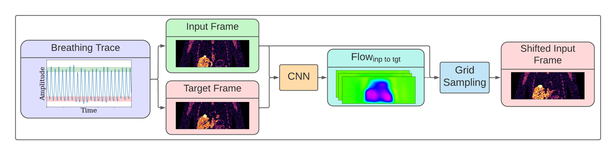
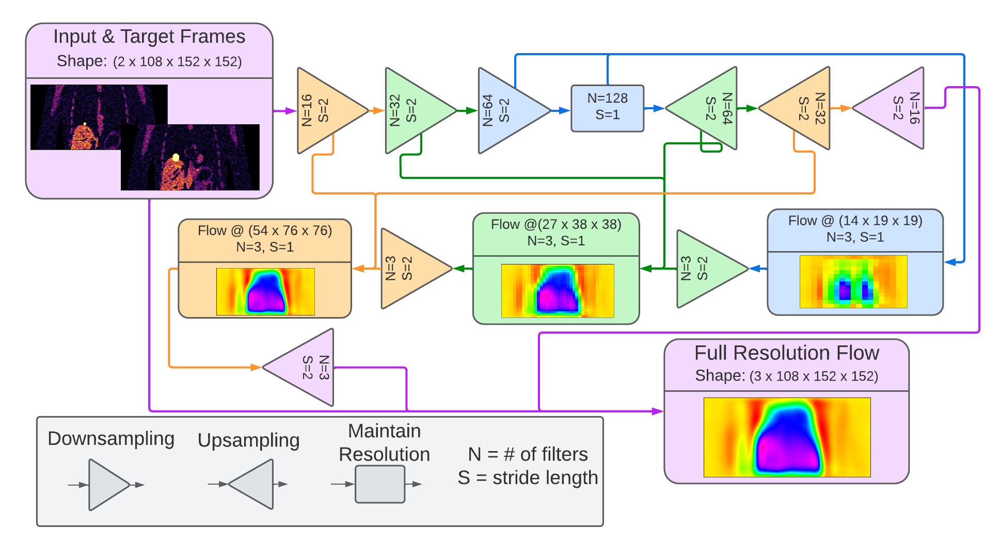

  

# FlowNet-PET
Unsupervised Learning to Perform Respiratory Motion Correction in PET Imaging

  

<b>Figure 1</b>: The FlowNet-PET framework.
 

  

<b>Figure 2</b>: The convolutional neural network architecture.
 

## Dependencies

-[PyTorch](http://pytorch.org/): `pip install torch torchvision`
  - We used version 1.10.0, but I would assume that other versions will still work.

-h5py: `pip install h5py`

-configparser: `pip install configparser`

## Data download

### Option 1
  
The test sets can be downloaded [here](https://zenodo.org/record/6510089) and the training set can be downloaded [here](https://zenodo.org/record/6510358) (this file is arounnd 50GB and not necessary for the analysis).

Once downloaded, unzip the files and place each file in the [data directory](./data/). For instance, after doing this you should have the file path `FlowNet_PET/data/xcat_frames_test_set.h5`.

### Option 2
  
To install from the command line:
  
  - install file downloader: `pip install zenodo_get`
  
  - download test sets:`zenodo_get 6510089`
  
  - download training set:`zenodo_get 6510358` (this file is arounnd 50GB and not necessary for the analysis)
  
Once downloaded, unzip the files and place each file in the [data directory](./data/). For instance, after doing this you should have the file path `FlowNet_PET/data/xcat_frames_test_set.h5`.

## Training the Network

### Option 1

1. The model architecture and hyper-parameters are set within configuration file in [the config directory](./configs). For instance, I have already created the [original FlowNet-PET configuration file](./configs/fnp_1.ini). You can copy this file under a new name and change whichever parameters you choose.
  
2. If you were to create a `fnp_2.ini` in Step 1, to train this model,  you can run `python train_flownet_pet.py fnp_2 -v 500 -ct 15.00` which will train your model displaying the progress every 500 batch iterations and saves the model every 15 minutes. This same command will continue training the network if you already have the model saved in the [model directory](./models) from previous training. 

### Option 2

Alternatively, if operating on compute-canada, you can use the `launch_model.py` script to simultaneously create a new configuration file and launch a bunch of jobs to train your model. 

1. Change the [load modules file](./module_loads.txt) to include the lines necessary to load your own environment with pytorch, etc. 
2. Then, to copy the [original FlowNet-PET configuration](./configs/fnp_1.ini), but use, say, a loss weight of 500 for the invertibility loss term, you could use the command `python launch_model.py fnp_2 -iw 500`. This will launch twelve 3-hour jobs on the GPU nodes to finish the training. You can checkout the other parameters that can be changed with the command `python launch_model.py -h`.

## Analysis notebooks

1. Checkout the [Testing on XCAT Frames notebook](./Testing_on_XCAT_Frames.ipynb) to evaluate the trained network on raw XCAT PET frames and compare the results to images with and without motion.
2. Checkout the [Comparing Against RPB notebook](./Comparing_Against_RPB.ipynb) to evaluate the trained network on XCAT PET data that is binned based on a clinical breathing trace. This notebook will compare the results against images produce by the retrospective phase binning method, which requires a scan duration that is six times longer.
3. Checkout the [Comparisons using MC Data notebook](./Comparisons_using_MC_Data.ipynb) to evaluate the trained network on Monte Carlo PET data that is binned based on a clinical breathing trace. This notebook will compare the results against images produce by the retrospective phase binning method, which requires a scan duration that is six times longer.
